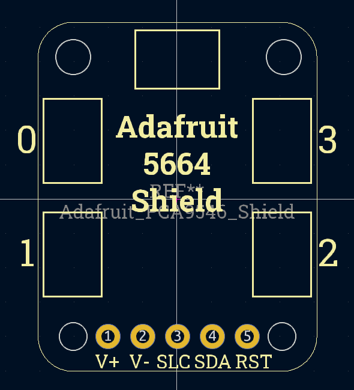
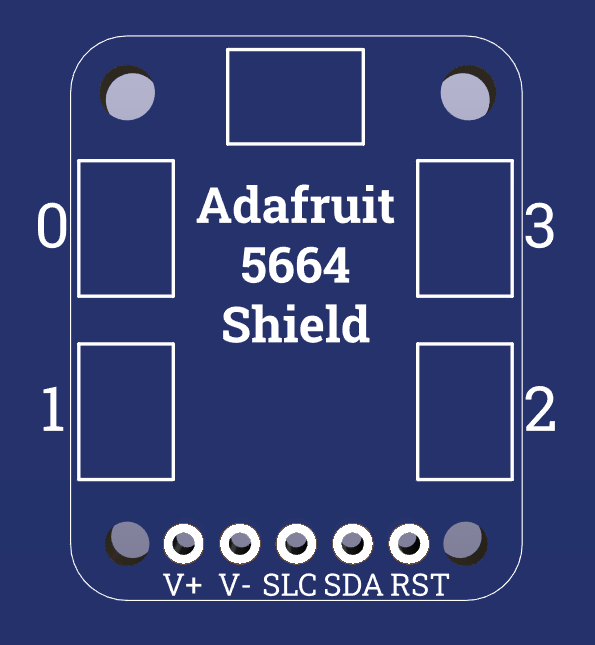
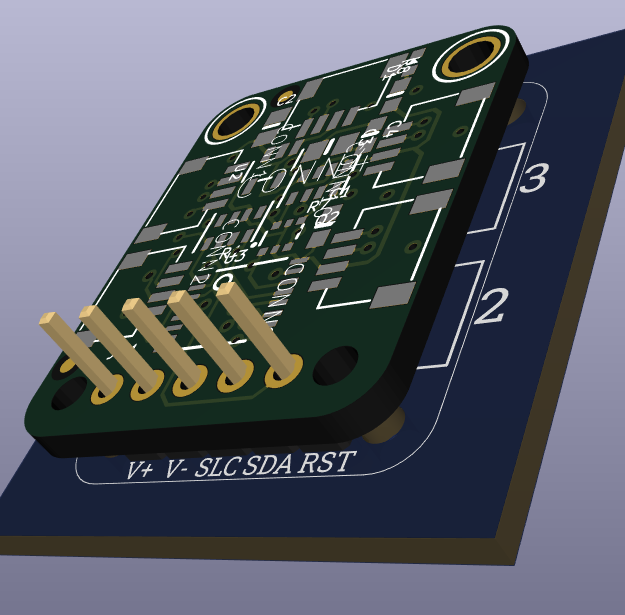

# Adafruit 5664 Shield

This is a KiCad library representing the
[Adafruit PCA9546 4-Channel STEMMA QT / Qwiic I2C Multiplexer](https://www.adafruit.com/product/5664),
as a shield.

This allows for a 4 Channel Qwiic I2C Multiplexer to be added to a PCB, without
the need for surface mount soldering.

## Images

Here is what the footprint looks like in KiCad:

### Footprint

### Silkscreen

### 3D Model

## Setup

To get the library working, you need to add path of this repository to the KiCad
library search path. This can be done by going to
`Preferences -> Configure Paths` and adding the path with the name
`Adafruit_5664_Shield`.

## License

This footprint is derived from the original board by Adafruit, used under CC
BY-SA 3.0. This library is also licensed under CC BY-SA 3.0.

The original board can be found at:
[github.com/adafruit/Adafruit-PCA9546-PCB](https://github.com/adafruit/Adafruit-PCA9546-PCB).
